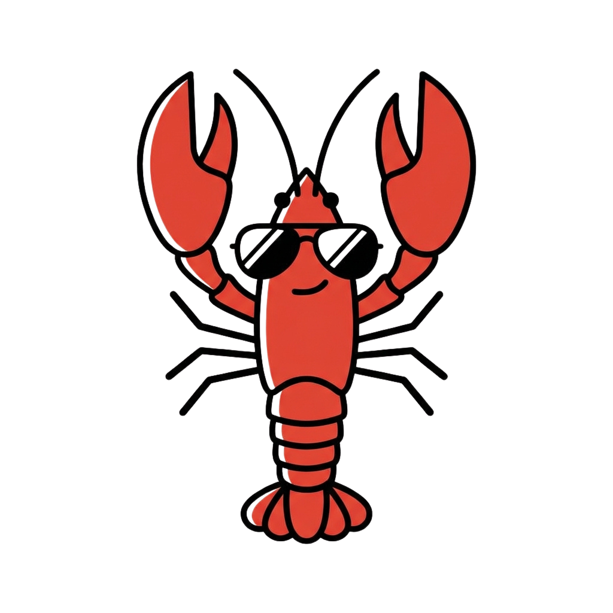

<p align="center">
  
</p>

<h1 align="center">EasyClaw</h1>

<p align="center">
  <strong>一键安装 OpenClaw AI 代理</strong>
</p>

<p align="center">
  <a href="README.md">English</a> · <a href="README.ko.md">한국어</a> · <a href="README.ja.md">日本語</a>
</p>

<p align="center">
  <a href="https://github.com/ybgwon96/easyclaw/releases/latest"></a>
  <a href="https://github.com/ybgwon96/easyclaw/releases"></a>
  
  <a href="LICENSE"></a>
</p>

<p align="center">
  <a href="https://easyclaw.kr">官网</a> · <a href="https://github.com/ybgwon96/easyclaw/releases/latest">下载</a> · <a href="https://github.com/openclaw/openclaw">OpenClaw</a>
</p>

---

<p align="center">
  
  &nbsp;&nbsp;
  
  &nbsp;&nbsp;
  
</p>

## 什么是 EasyClaw？

EasyClaw 是一个桌面安装器，可以**无需任何终端命令**即可设置 [OpenClaw](https://github.com/openclaw/openclaw) AI 代理。

**下载 → 运行 → 输入 API 密钥** — 三步即可完成。

## 主要功能

- **一键安装** — 自动检测并安装 WSL、Node.js 和 OpenClaw
- **多个 AI 提供商** — 支持 Anthropic、Google Gemini、OpenAI、MiniMax、GLM
- **Telegram 集成** — 通过 Telegram 机器人随时随地使用 AI 代理
- **跨平台** — 支持 macOS（Intel + Apple Silicon）和 Windows

## 下载

| 操作系统 | 文件   | 链接                                                             |
| -------- | ------ | ---------------------------------------------------------------- |
| macOS    | `.dmg` | [下载](https://github.com/ybgwon96/easyclaw/releases/latest/download/easy-claw.dmg) |
| Windows  | `.exe` | [下载](https://github.com/ybgwon96/easyclaw/releases/latest/download/easy-claw-setup.exe) |

也可以从 [easyclaw.kr](https://easyclaw.kr) 下载 — 会自动检测您的操作系统。

## Windows 安全提示

我们正在申请 Windows 代码签名证书。安装过程中可能会出现安全警告。

> - [VirusTotal 扫描结果](https://www.virustotal.com/gui/url/800de679ba1d63c29023776989a531d27c4510666a320ae3b440c7785b2ab149) — 94 个杀毒引擎检测结果为 0
> - 完全开源 — 任何人都可以审查代码
> - 使用 GitHub Actions CI/CD 构建 — 构建过程透明公开

<details>
<summary><b>如果出现"Windows 已保护你的电脑"提示</b></summary>

1. 点击 **"更多信息"**
2. 点击 **"仍要运行"**

</details>

## 技术栈

| 领域     | 技术                                                     |
| -------- | -------------------------------------------------------- |
| 框架     | Electron + electron-vite                                 |
| 前端     | React 19 + Tailwind CSS 4                                |
| 语言     | TypeScript                                               |
| 构建/CI  | electron-builder + GitHub Actions                        |
| 代码签名 | Apple Notarization (macOS) / SignPath (Windows, 进行中)  |

## 开发

```bash
npm install    # 安装依赖
npm run dev    # 开发模式 (electron-vite dev)
npm run build  # 类型检查 + 构建
npm run lint   # ESLint
npm run format # Prettier
```

平台特定打包：

```bash
npm run build:mac-local  # macOS 本地构建
npm run build:win-local  # Windows 本地构建
```

## 贡献

欢迎贡献！请先阅读 [CONTRIBUTING.md](CONTRIBUTING.md)。

## 致谢

基于 [OpenClaw](https://github.com/openclaw/openclaw)（MIT 许可证）— 由 [openclaw](https://github.com/openclaw) 团队开发

## 许可证

[MIT](LICENSE)
